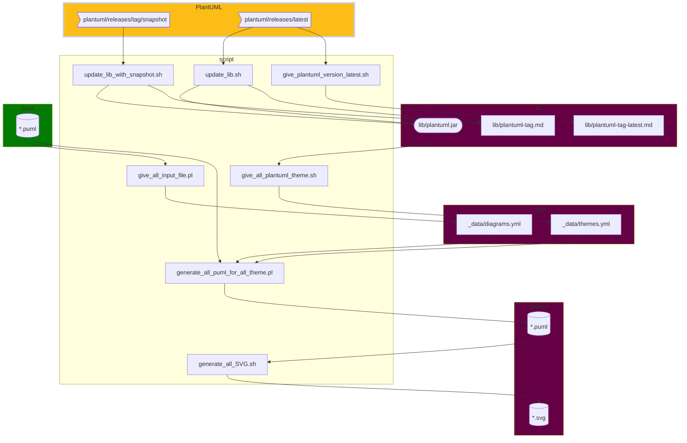

# `Script` dependance



## Legend
````mermaid
graph TB
a[modifiable]
style a fill:#047b04
b["auto-generated (not directly modifiable)"]
style b fill:#660044
c[PlantUML dependance]
style c fill:#fbbd16 
````
