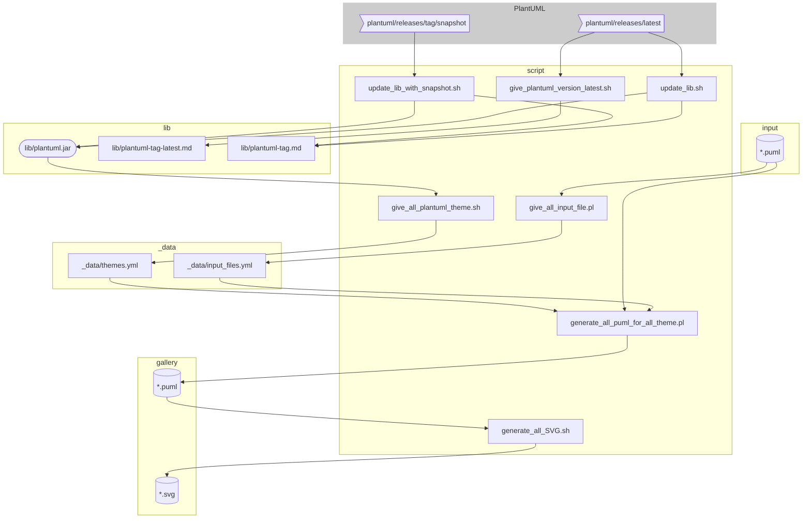

# `Script` dependance

```mermaid
flowchart TD

subgraph script
A[update_lib_with_snapshot.sh]
B[update_lib.sh]
VL[give_plantuml_version_latest.sh]
AllTheme[give_all_plantuml_theme.sh]
giveInput[give_all_input_file.pl]
genPUML[generate_all_puml_for_all_theme.pl]
genSVG[generate_all_SVG.sh]
end

subgraph input
i[(*.puml)]
end

subgraph _data
at[_data/themes.yml]
if[_data/input_files.yml]
end

subgraph PlantUML
s>plantuml/releases/tag/snapshot]
r>plantuml/releases/latest]
end
style PlantUML fill:#ccc,stroke:#ccc,stroke-width:4px

subgraph lib
b([lib/plantuml.jar])
vl[lib/plantuml-tag-latest.md]
v[lib/plantuml-tag.md]
end

subgraph gallery
puml[(*.puml)]
svg[(*.svg)]
end

s --> A --> b
r --> B --> b

r --> VL --> vl
A --> v
B --> v

b --> AllTheme --> at

i --> giveInput --> if

puml --> genSVG --> svg
at --> genPUML 
i --> genPUML 
if --> genPUML --> puml
```
